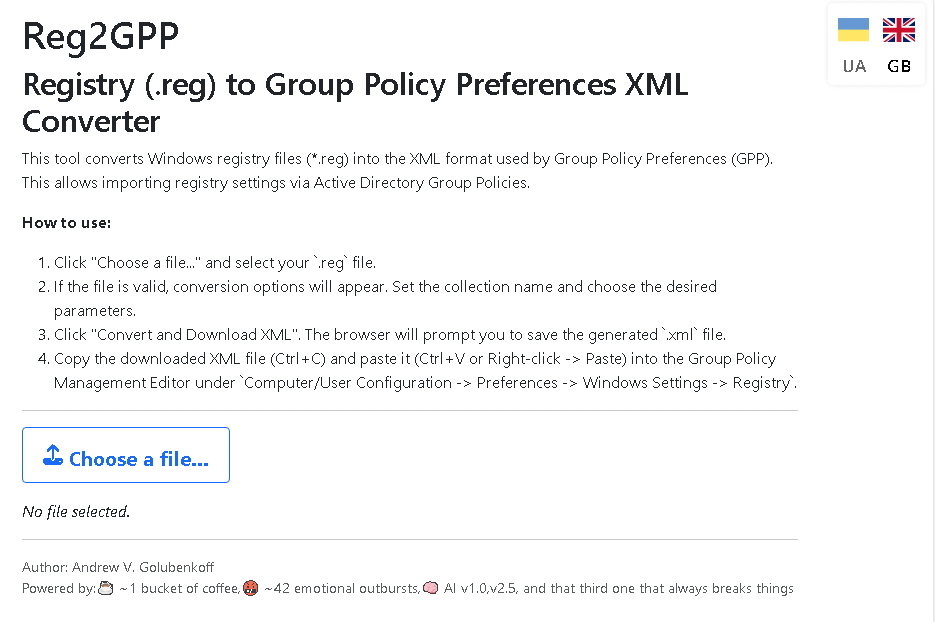

# Reg2GPP - Client-Side .reg to GPP XML Converter

This tool converts Windows registry files (`.reg`) into the XML format used by Group Policy Preferences (GPP). This allows administrators to easily import registry settings into Active Directory Group Policies, saving significant time and reducing errors compared to manual configuration.

This is a **client-side JavaScript version** inspired by the original PHP Reg2GPP by Sean Mackedie. All processing happens directly in your browser, meaning your `.reg` files are **never uploaded** to any server, ensuring privacy and security.

## Features

*   **Parses `.reg` files:** Supports standard Windows Registry Editor Version 5.00 format.
*   **Generates GPP XML:** Creates XML compatible with the Group Policy Management Editor for Registry Preferences.
*   **Client-Side Processing:** Runs entirely in your web browser using JavaScript. No server-side components needed.
*   **Configurable Options:**
    *   Set the **Collection Name** for the imported GPP item.
    *   Choose the **Default Action** (Create, Replace, Update, Delete) for registry values.
    *   Select **Common Options** (Stop on error, Run in user's context, Remove item when no longer applied, Apply once).
*   **Multi-Language Support:** Interface available in **Ukrainian (Українська) 🇺🇦** and **English 🇬🇧**. Language preference is saved locally.
*   **Handles Various Data Types:** Converts REG_SZ, REG_DWORD, REG_BINARY, REG_EXPAND_SZ, REG_MULTI_SZ, and REG_QWORD values from their `.reg` representation.
*   **User-Friendly Interface:** Built with Bootstrap 5 for a clean and responsive layout.

## How to Use

1.  **Open the File:** Download the `reg2gpp_converter.html` file and open it in your web browser (like Chrome, Firefox, Edge).
2.  **Select `.reg` File:** Click the "Choose a file..." (or "Виберіть файл...") button and select the `.reg` file you want to convert.
3.  **Configure Options:** If the file is valid, the "Conversion Options" section will appear.
    *   Enter a descriptive **Collection Name**.
    *   Select the desired **Default Action** and **Common Options**.
4.  **Convert & Download:** Click the "Convert and Download XML" (or "Конвертувати та завантажити XML") button.
5.  **Save XML:** Your browser will prompt you to save the generated `.xml` file. Choose a location to save it.
6.  **Import into GPP:**
    *   Open the **Group Policy Management Editor** (gpmc.msc).
    *   Navigate to the desired GPO, then go to `Computer Configuration` (or `User Configuration`) -> `Preferences` -> `Windows Settings` -> `Registry`.
    *   Right-click in the empty space on the right pane and select **Paste**.
    *   The settings from your XML file should be imported as a new Registry Collection item. Review the imported settings.

## Language Switching

Click the flag icons (🇺🇦 / 🇬🇧) in the top-right corner of the page to switch between Ukrainian and English languages. Your selected language will be remembered for future visits.

## Technology Stack

*   HTML5
*   CSS3 (with Bootstrap 5)
*   JavaScript (ES6+)

## How it Works (Briefly)

The tool uses the browser's built-in APIs:
*   **FileReader API:** Reads the content of the selected `.reg` file locally.
*   **DOMParser / XMLSerializer API:** Parses the `.reg` data line by line and constructs an XML Document Object Model (DOM) according to the GPP schema. The resulting XML DOM is then serialized into a string.
*   **Blob / ObjectURL API:** Creates a downloadable file from the generated XML string without needing a server.
*   **LocalStorage API:** Stores the user's language preference.

## Limitations

*   Processing very large `.reg` files (many megabytes) might be slow or consume significant memory in the browser.
*   Parsing complex or non-standard `.reg` file variations might lead to unexpected results. Please report any issues.